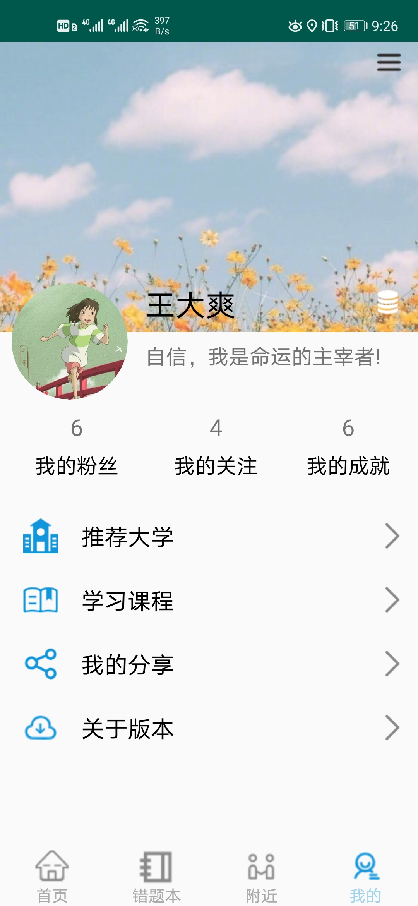

# 小葵花 
      一款帮助高中生练就绝世神功的app  
[下载体验](https://fir.im/4hzf)

## 项目简介
         随着高中生学习压力上增以及电子产品的不断发展，越来越多的学校摆脱传统的错题本模式利用软件来快速的搜索和记录错题。
     但是市场现有的软件功能过于单一，不能进行多功能的深度融合来满足高中生和老师的多种需求。基于该情况，我们将用户急需的
     需求进行了初步的整合。高中生和老师可以通过该软件对名校进行初步的认识和了解，对具体详细的查询起到抛砖引玉的作用。高
     中生可以将重要的错题进行拍照记录和查看相关的讲解视频，避免查而不会或查而不懂的问题。有鉴于此，我们的项目应运而生。

## 项目展示

 

 
 ## 项目成员
  
 ##### 杨柳鑫  单鑫楠   王爽  刘鹏辉  郭伟  吕怡浩   金鑫媛
 用户反馈内容请加入Turings官方QQ群，留下您宝贵的意见~
 

 

  

